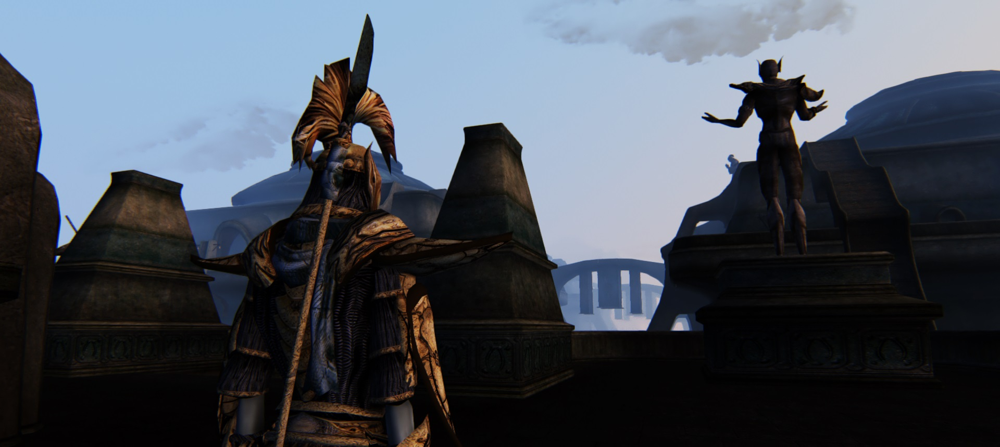

# MORROWIND S#ARP – An Elder Scrolls III: Morrowind Modlist

## About

**Morrowind Sharp** is a modular modlist for **The Elder Scrolls III: Morrowind**. It addresses a number of significant issues with the game:

- Bugs and stability: includes all major bug fixes released for the game so far, with an emphasis on squashing the most noticeable bugs.
- User interface: improved functionality and expanded hotkeys.
- Visuals: vanilla-friendly high resolution upscaled textures, basic texture and mesh improvements, more immersive lighting.
- Gameplay: basic quality of life improvements, leaving the core experience intact. My opinion is that Morrowind is not to be enjoyed because of its gameplay, so the best thing we can do is to accept it for what it is.
- DLCs: reworked implementation, expansions delayed and rebalanced.

Because this modlist is offered "as is" and to be considered complete, I won't be answering compatibility questions. Instructions on the installation and use of [**TES3View**](appendix.md#checking-for-conflicts) are provided. Use that tool to detect and solve conflicts.

Two versions of this modlist are available:
- The standard version, consisting of roughly 100 mods.
- The essentials version, consisting of roughly 30 mods.

[**Click here to get started**](setup.md).

## My setup

When installing this modlist, including the recommended shaders, my framerate ranges anywhere from 10fps (at worst, in the Grazelands) to 30fps (indoors), through 20fps outdoors. For reference, here is a my setup.

System | My Specs
------------ | -------------
Operative System | Windows 8.1 Pro 64-bit
CPU | Intel Core i5 4440
RAM | 8GB
Graphics | 1GB ATI AMD Radeon HD 7700 Series
HDD | 1TB
Monitor | Samsung 24" 1080p @ 60Hz

## Frequently asked questions

### How much space do I need to install these mods?

5.4GB. Morrowind Enhanced Textures accounts for most of that space (4.3GB), and it is entirely optional, even if thoroughly recommended.

### Is this modlist compatible with OpenMW?

No. Many mods require MWSE to work.

## Suggested readings

Morrowind Sharp isn't meant to be an exhaustive modlist. It attempts to cover the basics and go a little beyond that. For additional documents which tackle many mods not covered here, I suggest looking up the following:

- **Lucevar**'s [**Themed Mod Lists**](https://github.com/Lucevar/mw-immersion-mods).
- **Danae**'s [**Modlists**](https://danaeplays.thenet.sk/tag/modding/) (I would also suggest checking out [**her YouTube channel**](https://www.youtube.com/user/terdanae) for cool Morrowind content).
- **rfuzzo**'s [**Morrowind++**](https://r-fuzzo.gitbook.io/morrowind++/) guide, which covers most mods featured in Morrowind Sharp, and much more, for a less purist experience.
