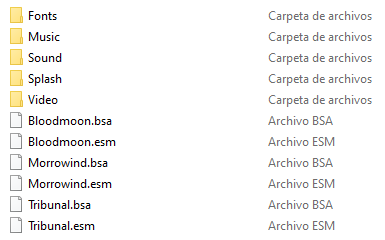

## [<< Readme](readme.md)

# Setup

In this step, we will do a clean installation and configuration of the game, which is required for the guide.

## Requirements

- An english copy of the game from [**GOG**](https://www.gog.com/game/the_elder_scrolls_iii_morrowind_goty_edition?gclid=EAIaIQobChMIoaWD-6LP6AIVCxCRCh2a5gPiEAAYASAAEgIUSvD_BwE) or [**Steam**](https://store.steampowered.com/app/22320/The_Elder_Scrolls_III_Morrowind_Game_of_the_Year_Edition/).
  - Only the English version of the game is supported for maximum compatibility; translations can conflict with mods and cause issues.
- At least 13.0 GB of free drive space.
- A text editor ([**Notepad++**](https://notepad-plus-plus.org/downloads/v7.9.5/) is recommended, but the default Windows notepad will work).
- An archiving tool ([**7-Zip**](https://www.7-zip.org/) is recommended. If you use Windows 11 then [**NanaZip**](https://apps.microsoft.com/store/detail/nanazip/9N8G7TSCL18R?hl=en-us&gl=us) is a better option).
- A [**Nexus Mods**](https://users.nexusmods.com/register) account (a Premium subscription will allow uncapped speeds).

## Install Location

A clean installation is not only required to get rid of any potential leftover mod files, but also to make sure the game is installed in a safe location. Here is what you need to know when choosing where to install your game:

- **Avoid any default Windows folders:** This includes but is not limited to C:\Program Files, C:\Program Files x86, your Desktop and your Documents folders. This is due to Windows UAC (or User Account Control), which heavily monitors and protects these folders. This can cause many issues with the game and any modding tools. An example of a safe location is C:\Games\Steam and C:\Games\GOG Galaxy.
- **Install on an SSD if possible:** Having the game on an SSD will drastically improve loading times and decrease stuttering.

## Uninstalling the Game

> ℹ️ If you do not have the game installed yet, skip this step.

### Steam

- Open Steam and go to your **Library**.
- Find **The Elder Scrolls III: Morrowind** in the list.
- Right-click on it and select **Manage** -> **Uninstall**.
- Navigate to Steam\steamapps\common\ and, if present, delete the **Morrowind** folder.

### GOG

- Open GOG Galaxy and go to your **Installed** games.
- Find **Morrowind** in the list.
- Right-click on it and select **Manage installation** -> **Uninstall**.
- Navigate to GOG Galaxy\Games\ and, if present, delete the **Morrowind** folder.

## Installing the Game

> ℹ️ It is strongly recommended to install the game outside of any default Windows folders (such as Program Files (x86)), as the the strict Windows file protections of these folders can break certain mods/tools.

### Steam

> ℹ️ We will use a tool called Steam Library Setup Tool to create a new Steam library folder outside of any default Windows folders. If you already have Steam installed outside of any default windows folders then skip this step and simply install the game to your custom Steam library.

- Completely exit out of Steam using Task Manager or System Tray.
- Download the **steam_library_setup_tool-3.2.exe** file from [**here**](https://github.com/LostDragonist/steam-library-setup-tool/releases).
- Once downloaded, run the file and add a new entry by clicking **Add Row**.
- Type the chosen path under **Path**, e.g. C:\Games\Steam
- Click **Accept** then **Yes** if prompted to create a new folder.
- The tool will ask to exit, select **OK**.
- Open Steam and go to your **Library**.
- Find **The Elder Scrolls III: Morrowind** in the list and select **Install**.
- Under **Install to:**, select the library folder created with the tool - the second C:\ entry if you are installing on the main drive.

> ℹ️ If you still do not see your new library, restart your PC.

- Select **Next** then wait for the install to finish.

### GOG

- Open GOG Galaxy and go to your **Owned Games**.
- Find **Morrowind** in the list and select **Install**.
- Under **Install to**, select **C:\Games\GOG Galaxy\Games**.
- Select **Install** then wait for the install to finish.

Note that the GOG release of Morrowind ships with files we do not need, including the [**official plugins**](https://en.uesp.net/wiki/Morrowind:Plugins) Bethesda released for Morrowind. We will install a merged and fixed version of these plugins in the guide, so we don't need the original files.

- Delete the following files from your **Morrowind\Data Files** folder in order to free about 700 MBs from your install:
  - **BookArt** folder.
  - **Icons** folder.
  - **Meshes** folder.
  - **Textures** folder.
  - All **.esp** files. There should be 8 of them, corresponding to the official plugins.
  - All **.txt** files. There should be 8 of them, corresponding to the official plugins.
- Your **Data Files** folder should now look like this.



## Post-Installation

### Official Map

Morrowind originally shipped with a detailed map which is absent from digital stores. You can get this map [**here**](pictures/map.jpg).

### Key Terminology

Now that the game is installed, there are two folders from it that will be referred to in the guide often:

- **Root** folder: Where the game is installed.
> Steam\steamapps\common\Morrowind

> GOG Galaxy\Games\Morrowind
- **Data Files** folder: Where all of the game's assets are located.
> Steam\steamapps\common\Morrowind\Data Files

> GOG Galaxy\Games\Morrowind\Data Files

### Enabling File Extensions

By default, File Explorer will not show file extensions (such as .exe, .dll, or .esp). These extensions are very important when going through the guide, so it is highly recommended to enable visible file extensions:

- Open File Explorer.
- Select the **View** tab at the top.
- Enable **File name extensions** in the **Show** section.

# Utilities

## Installing the Morrowind Code Patch

In this step, we will download and run the Morrowind Code Patch, which directly patches bugs in Morrowind.exe which can't be otherwise fixed by installing mods.

- Download the [**Morrowind Code Patch**](https://www.nexusmods.com/morrowind/mods/19510) (Main files - Manual Download).
- From the downloaded archive, extract everything to the game's **Root** folder.
- Download the [**MCP beta**](https://www.nexusmods.com/morrowind/mods/26348) (Update files - Manual Download).
- From the downloaded archive, extract everything to the game's **Root** folder, and overwrite when prompted.
- Run **Morrowind Code Patch.exe**.
- Install the patches listed on this [**spreadsheet**](https://docs.google.com/spreadsheets/d/1r6fv59to4-KgHJgCm-GDNnwSmD3LdDmamSDEs5jKFdM/edit?usp=sharing).
- Click **Apply chosen patches**, and exit.

> ℹ️ A backup of **Morrowind.exe** (pre-patch) will apear in your **Root** folder, named **Morrowind.Original.exe**.

## Installing MGE XE

In this step, we will download and install MGE XE, which allows Morrowind to render distant views, scenery shadows, high quality shaders and other features, as well as install the latest MWSE version, which allows Lua-based mods to function.

- Download [**MGE XE Manual Install**](https://www.nexusmods.com/morrowind/mods/41102?) (Main files - Manual Download).
- From the downloaded archive, extract everything to the game's **Root** folder.
- Run **MWSE-Update.exe**. This will update MWSE to the latest version.
- Delete **XE Sky Variations.esp** from your **Data Files** folder. This plugin won't be necessary after we install **Weather Adjuster** in the main guide.

## Installing tes3cmd

In this step, we will download tes3cmd, which cleans plugins by automatically deleting identical-to-master records, usually *unintended* by the author as they do nothing in practice, but which may override *intended* changes by other mods.

- Download [**tes3cmd**](https://github.com/john-moonsugar/tes3cmd/releases/download/v0.40-pre-release-2/tes3cmd.exe).
- Place tes3cmd.exe in your **Data Files** folder.
 
## Installing TES3Merge

In this step, we will download ES3Merge, which solves conflicts by merging conflicting records into a separate plugin.

- Install [**.NET 6.0**](https://dotnet.microsoft.com/en-us/download). Be sure to install 6.0 and *not* 7.0, or else TES3Merge won't run.
- Download [**TES3Merge**](https://www.nexusmods.com/morrowind/mods/46870) (Main files - Manual Download).
- From the downloaded archive, extract everything to the game's **Root** folder.
- Download [**TES3Merge Custom INI**](https://www.nexusmods.com/morrowind/mods/54200?tab=files&file_id=1000043082).
- From the downloaded archive, extract everything to the game's **Root** folder, and overwrite when prompted. This file includes updated merging rules to ensure no merging issues with the mods installed in the guide.

## Installing Wrye Mash

In this step, we will download and install Wrye Mash, which repairs and updates saves, updates the masters of mods, and runs tes3cmd.exe in order to clean plugins and generate a plugin which fixes a number of issues with mod setups.

- Download [**Wrye Mash 2021 - x64**](https://www.nexusmods.com/morrowind/mods/45439?tab=files&file_id=1000022924).
- From the downloaded archive, extract everything to the game's **Root** folder.
- Run **mash64.exe**, found in **Morrowind\Mopy**.
- Click **Next**.
- Fill the paths as follows:
   - **Morrowind directory**: select your **Root** folder. A message should state that **morrowind.ini** and the **Data Files** folder were found.
   - **Mods Installers directory**: select your **Games** folder. This path is indistinct, as we will not use Wrye Mash to install mods.
- Click **Next** and then click **Finish**.
- Click **Yes** on the MWSE detected pop-up. If you are not greeted with this pop-up or misclicked, do the following:
  - Click the cog wheel button at the bottom of the window to open the **Wrye Mash Settings** window.
  - Click the **Advanced** tab, and check the option to add support for up to 1024 plugins. Failing to enable this option can cause you to be unable to repair your saves.
  - Click **OK**.
- Close Wrye Mash.

> ℹ️ **Mlox** is a tool to analyze and sort your plugin order. However, there's no need to install it when following **Morrowind Sharp**, as I'll provide the optimal load order for the mods recommended here.

# Mod Organizer 2

In this step, we will install and configure Mod Organizer 2.

## Installing Mod Organizer 2

- Download **Mod Organizer 2** from [**here**](https://github.com/ModOrganizer2/modorganizer/releases/download/v2.5.1rc2/Mod.Organizer-2.5.1rc2.7z).
- Once the download has finished, extract the archive and put the folder in any location outside of any default Window folders (like Program Files x86) and outside of the game's **Root** folder, e.g.  **Games\Morrowind Modding\MO2**

## Configuring Mod Organizer 2

### MO2 Setup

- Run **ModOrganizer.exe**.
- Select **Create a portable instance** as the instance to create.
- Select **Morrowind** as the game to manage.
- Configure your profile as follows:
  - [X] Use profile-specific game INI files
  - [X] Use profile-specific save games
  - [ ] Automatic archive invalidation
- On the next page, keep the **Location** file path default.

> ℹ️ If you have MO2 installed on an SSD or a HDD with little space, you can check the **Show advanced options** box and change the **Downloads** file path to a different drive with more space. This will not effect download/game performance, and the downloads can be deleted after the mods have been installed.

- On the last page, select **Finish**.
- MO2 will launch and prompt you with **Category Setup**, select **Do Nothing**.
- From the pop-up called **Register?**, select **Yes**.
  - This pop-up will not show up if you have already registered a different instance of MO2.

### Configuring Settings

- Select the **X** in the bottom right of MO2 to close the log window.
- Select the  button at the top of MO2 to open the settings.
- In the **Theme** tab, you can select a different style of your choosing from the drop-down menu at the top.
- In the **Nexus** tab, select **Connect to Nexus**.
  - This option will not show up if you have already connected your Nexus account on a different MO2 instance.
- MO2 will open your browser and prompt you to authorize the connection.
- Once you authorize it, you can close out of your browser and of the MO2 settings.
- Allow MO2 to restart if it asks.

### Setting Up Plugins

- Once Mod Organizer 2 has loaded, right-click in the right pane and select **Enable all**.
- Order the plugins in the right pane as follows:

```
Morrowind.esm
Tribunal.esm
Bloodmoon.esm
```

### Adjusting Morrowind.ini

In this step, we will edit the Morrowind.ini to account for the **Rain/snow collision** patch we installed with the Morrowind Code Patch.

- Click the  button at the top of MO2 and select **INI Editor**.
- Use CTRL+F to input the section names and edit the respective entries to use these values. Note that **Weather Snow** may be found much further down below than the others, just below the **Archives** section.

```
[Weather Rain]
Rain Diameter=1200
Max Raindrops=1500

[Weather Thunderstorm]
Rain Diameter=1200
Max Raindrops=3000

[Weather Snow]
Snow Diameter=1600
Max Snowflakes=1500
```

- Click **Save** and close the window.

## Registering Tools

In this step, we will register our modding tools in Mod Organizer 2 for them to detect our installed mods.

- Click the  at the top of MO2 to open the executables menu.
- Click the  button and choose **Add from file...**.
- Navigate to **Morrowind\Mopy** and double click **mash64.exe**.
- Click **Apply**.
- Click the  button and choose **Add from file...**.
- Navigate to **Morrowind** and double click **TES3Merge.exe**.
- Click **Apply**.

> ℹ️ **tes3cmd** doesn't need to be registered in Mod Organizer 2 as it is directly run from Wrye Mash.

## Configuring MGE XE

In this step, we will run MGE XE through Mod Organizer 2 to configure it.

- In Mod Organizer 2, click on the executables dropdown menu to the left of the **Run** button, and select **MGE XE**. 
- Run **MGE XE**.

### In-game tab

- Enable **Allow yes to all load errors** under **Morrowind engine settings**.

> ℹ️ **Use D3D8To9 proxy only** essentially enables "purist mode". All graphical enhancements, including shaders and the distant land features, will be disabled. However, MWSE will remain enabled, which is crucial to run some of the latest and most advanced mods. Feel free to enable this option if you are looking for a purist visual setup. You will still be able to change your resolution in the **Graphics** tab.

> ⚠️ Do note that certain mods *require* MGE XE to work as intended, and your game may crash with MGE disabled in-game.

> ⚠️ You may be tempted to enable **High detail actor shadows (buggy)**. As the name says, they are buggy and can be very taxing on your framerate. I don't recommend them.

### Graphics Tab

- Set **Resolution** according to your monitor or preferred windowed resolution.
- Enable **Windowed Mode** and **Borderless window**. This allows for safe ALT+TAB during gameplay, at the cost of minimal performance drops (unnoticeable depending on your setup).
- Set **VSync** to On.
- Set **Antialiasing** to x8.
- Set **Anisotropic Filtering** to x16. If your graphics card doesn't support this level, it will automatically drop to the highest supported level.
- Higher **Menu UI scaling** settings will scale up the UI. If you are playing on high resolutions (1080p and higher) I recommend starting with values at 1,20.
- Lower **FPS Limiter** settings will increase the consistency of your framerate. I personally set it to **60**.

### Distant Land Tab

All options minus **Use Distant Land** and **Distant land generator wizard** are disabled when you get to this tab. We need to generate distant land for these options to become available.

- Click **Distant land generator wizard**.
- On the **Distant Land Setup Wizard**, click **Select all**. The checked plugins will be used for distant land generation.
- Click **Continue**. This will open the **Distant Land Generation** window.
- In the **Land Textures** tab, click **Create Land Textures**.
- In the **Land Meshes** tab, set **World mesh detail** to **Ultra High** then click **Create Land Meshes**.
- In the **Statics** tab:
  - Set **Minimum Static Size** to 100.
  - Check **Include reflective water in interiors**.
  - Click **Create Statics**.
- Wait then click **Finish**.


Now that you are back on the **Distant Land** tab you will see all previously unavailable options are now enabled. To get you started, I recommend you copy the settings as shown in the image above. These draw distance settings will preserve the foggy aesthetic of vanilla Morrowind, which I recommend over the absurd draw distance seen in most modern Morrowind screenshots. If you are aching for a little bit of extra draw distance, I suggest increasing the **Draw Distance** to 5,0, and cranking up the **Above Water Fog** settings to Start 3,0 and End 5,0.

A rule of thumb is to regenerate your distant land any time you install or uninstall mods. Most importantly, the process will be much easier as you only need to click on **Run above steps using saved / default settings** the next time you are on the **Distant Land Generation** window. On your first distant land generation, MGE XE defaults to **Distant Land configuration setup...**.

> ⚠️ Note that Per-pixel lighting takes a heavy toll on your framerate. You can disable it entirely, or limit it to **Interiors only**.

## Mod Installation Instructions

When the guide says to install a mod, it will be formatted as follows: **Main File - Example 1.5**. This is referring to the mod's category on Nexus and file name.
The guide will list a mod's specific file name, category and version if you need to do more than just download the latest main file.

Standard mod installation procedure:

1. Unless instructed otherwise by the guide, download a mod's latest main file using the **Mod Manager Download** button.
2. Once the download has finished, open **Downloads** tab in MO2 (right pane, below executable selector).
3. Double-click on the mod to install it.
4. Enable the mod on the left pane.

Sometimes, a mod will not have a **Mod Manager Download**, or will be hosted on a site other than Nexus.
If that is the case, do the following:

1. Click the **Manual Download** button (or whatever the download button is for the respective site).
2. Once the download has finished, click the  button at the top of MO2.
3. From the new window, navigate to where the file was downloaded to and double-click it.
4. Finish the install as you would with a **Mod Manager Download** mod.

When downloading multiple files from the same page, you will be prompted with a box in Mod Organizer 2 with the options **Merge**, **Replace** and **Rename**.

- You should select the **Rename** option and rename the mod to its respective file name, this will make MO2 install them as separate files for easier management.
- If you are updating from an old version of a mod, you should select **Replace**, this will automatically delete all the files from the old version of the mod and replace them with the ones from the new version.
- **Merge** should only be used when you are sure the mod will not be updated and in situations where a hotfix is uploaded as separate file.

## [<< Readme](readme.md) | [Morrowind Sharp >>](main.md)  
