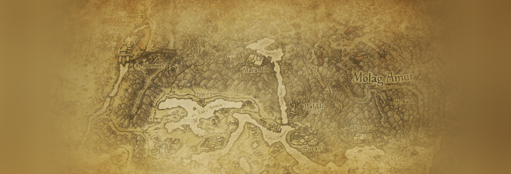
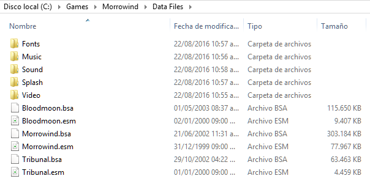
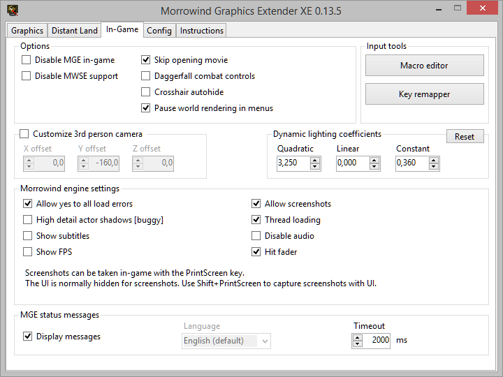
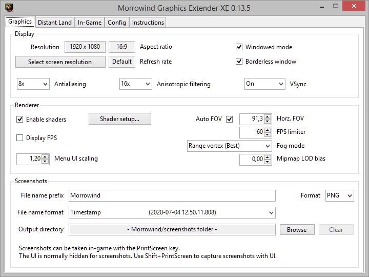
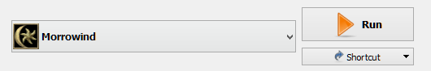

[<< Back to Readme](readme.md)

> PROTIP: Click on the list icon on the upper left corner of this document to see the index for this guide.

# THE ELDER SCROLLS III: MORROWIND SETUP



## REQUIREMENTS

- An english copy of the game from [**GOG**](https://www.gog.com/game/the_elder_scrolls_iii_morrowind_goty_edition?gclid=EAIaIQobChMIoaWD-6LP6AIVCxCRCh2a5gPiEAAYASAAEgIUSvD_BwE).
  - Installation instructions are found on the next section. 
- A [**Nexus**](https://users.nexusmods.com/register) account.
  - A free account will work just fine.
- A file archiver, such as [**7-Zip**](https://www.7-zip.org/).
- A text editor, such as [**Notepad++**](https://notepad-plus-plus.org/downloads/v7.9.5/).
- [**.NET 6 Runtime**](https://dotnet.microsoft.com/en-us/download) (required by TES3Merge, a conflict resolution tool).

> ℹ️ Morrowind originally shipped with a detailed map which is absent from digital stores. [**You can get this map here.**](pictures/map.jpg)

## INSTALLATION

Install Morrowind to GOG's default directory:
```
C:\Games
```
This will create a folder in the following path, which we will refer to as our **Root** folder.
```
C:\Games\Morrowind
```
This is where the game's executable (**Morrowind.exe**), launcher (**Morrowind Launcher.exe**), and **Data Files** folder will be found.

Should you decide to install Morrowind someplace else, install it outside all default Windows folders (Program Files, Program Files (x86), Desktop, and Documents for example). Windows User Account Control monitors these folders, which can cause problems later on.

## POST-INSTALLATION

The GOG release of Morrowind ships with files we do not need, including the [**official plugins**](https://en.uesp.net/wiki/Morrowind:Plugins) Bethesda released for Morrowind. The general opinion is that these low quality plugins and not worth your time.

Delete the following files from your **Morrowind\Data Files** folder in order to free about 700 MBs from your install:

- **BookArt** folder.
- **Icons** folder.
- **Meshes** folder.
- **Textures** folder.
- All **.esp** files. There should be 8 of them, corresponding to the official plugins.
- All **.txt** files. There should be 8 of them, corresponding to the official plugins.

Your Data Files folder should now look like this.



## NEXUS DOWNLOADS

Most mods downloaded for Morrowind will be acquired through [**Nexus**](https://www.nexusmods.com/morrowind). To download a mod, access the **Files** tab on the mod's Nexus page.


This option downloads the archive to your mod manager, from which you can install it. Most mods have this download option available, as the vast majority don't require specific installation instructions.


This option downloads the archive to your computer. You will need to manually add the mod to your mod manager in order to install it. For the most part, mods that should be installed *without* the use of a mod manager will have this download option as the only available method.

For this first part of the guide, files will be downloaded using the manual download option exclusively. For the second part of the guide, files will be downloaded using the mod manager download option.

## UTILITIES AND TOOLS

### [**Morrowind Code Patch**](https://www.nexusmods.com/morrowind/mods/19510)

Directly patches bugs in Morrowind.exe, which can't be otherwise fixed by installing mods.

- Manually download **Morrowind Code Patch** (Main files).
- Extract the contents of the file in your Morrowind **Root** folder (**C:\Games\Morrowind**). Doing so correctly should place a **Morrowind Code Patch.exe** in the same folder as your **Morrowind.exe**.
- Manually download **MCP beta** (Update files) from [**MCP Skunk Works**](https://www.nexusmods.com/morrowind/mods/26348).
- Extract the contents of the file in your Morrowind **Root** folder (**C:\Games\Morrowind**), and overwrite when prompted. This will update the Morrowind Code Patch to the latest beta version. Despite being a beta version, it is perfectly stable and encouraged to install.
- Execute **Morrowind Code Patch.exe**. The program will prompt you to install your patches of choice. Use this [**spreadsheet**](https://docs.google.com/spreadsheets/d/1r6fv59to4-KgHJgCm-GDNnwSmD3LdDmamSDEs5jKFdM/edit?usp=sharing) as a reference to install or skip patches.
- When you are finished, click **Apply chosen patches**. Close the application.

> ℹ️ A backup of **Morrowind.exe** (pre-patch) will apear in your **Root** folder, named **Morrowind.Original.exe**.

### [**MGE XE**](https://www.nexusmods.com/morrowind/mods/41102?)

Allows Morrowind to render distant views, scenery shadows, high quality shaders and other features. MGE XE supports and includes the latest **MWSE 2.1 beta**, so that the newest Lua-based mods work straight away.

- Manually download **MGE XE Manual Install** (Main files).
- Extract the contents of the file in your Morrowind **Root** folder (**C:\Games\Morrowind**), and overwrite when prompted. Doing so correctly should place a **MGEXEgui.exe** in the same folder as your **Morrowind.exe**.

### [**Wrye Mash**](https://www.nexusmods.com/morrowind/mods/45439)

Repairs and updates saves, updates the masters of mods, and runs tes3cmd in order to clean plugins and generate a **multipatch**.

- Manually download **Wrye Mash 2019 - x64 - manual installation archive** (Main files).
- Extract the contents of the file in your Morrowind **Root** folder (**C:\Games\Morrowind**), and overwrite when prompted.
- Manually download **Wrye Mash 2021 - x64 - beta6 - manual installation archive** (Update files) from the same page linked above.
- Extract the contents of the file in your Morrowind **Root** folder (**C:\Games\Morrowind**), and overwrite when prompted. This will update Wrye Mash to the latest beta version.
- Execute **mash64.exe**, found in **C:\Games\Morrowind\Mopy**.
- Eventually the installation wizard will ask you to fill the following entries:
   - **Morrowind directory**: select your Morrowind **Root** folder (**C:\Games\Morrowind**). A message should state that **morrowind.ini** and the **Data files** folder were found.
   - **Mods Installers directory**: select your Morrowind Mods folder (**C:\Games\Morrowind Mods**).
- Click **Next** and then click **Finish**. Wrye Mash will now launch.
- Click the cog wheel button on the bottom of the window, opening the **Settings** window.
- Click the **Advanced** tab, and check the option to add support for up to 1024 plugins. Failing to enable this option can cause you to be unable to repair your saves.
- Click **OK**, and close the program.

> ℹ️ **Mlox** is a tool to analyze and sort your plugin order. However, there's no need to install it when following **Morrowind Sharp**.

### [**tes3cmd**](https://github.com/john-moonsugar/tes3cmd/releases/download/v0.40-pre-release-2/tes3cmd.exe)

Cleans plugins by automatically deleting identical-to-master records (records that are usually *unintended* by the author as they do nothing in practice, but which may override *intended* changes by other mods).

- Place tes3cmd.exe in **C:\Games\Morrowind\Data Files**.

### [**TES3Merge**](https://www.nexusmods.com/morrowind/mods/46870)

Solves conflicts by merging conflicting records into a separate plugin, **Merged Objects.esp**.

- Manually download **TES3Merge** (Main files).
- Extract the contents of the file to **Morrowind Mods\TES3Merge**.

### [**TESAME**](https://www.nexusmods.com/morrowind/mods/50810)

Cleans plugins and solves conflicts by manually deleting conflicting or dirty records (unintended changes by the mod's author).

- Extract the contents of the file to **Morrowind Mods\TESAME**.

### [**Mod Organizer 2**](https://www.nexusmods.com/skyrimspecialedition/mods/6194)

An excellent mod manager, offering lots of quality of life conveniences that make modding an easy and quick process.

- Manually download **Mod Organizer 2** (Main files), and run the executable.
- When prompted to choose an install location, choose **C:\Games\Morrowind Mods\MO2**.
- When installation has finished, click **Finish**.
- The **Instance manager** window will appear. Click the **Create a new instance** button on the upper left.
- Choose **Create a portable instance**. You will be asked to select a game to manage. Click **Browse...** and choose your game's **Root** folder.
- You will be asked to select a folder where data will be stored. The default MO2 folder (**C:\Games\Morrowind Mods\MO2**) is fine.
- Click **Next** and then **Finish**. Mod Organizer 2 will now launch.

> ℹ️ If you get a pop-up called **Register?**, choose **Yes**. This will allow Mod Organizer 2 to handle Nexus links.

> ℹ️ If you get a pop-up called **Show tutorial?**, choose **No**.

You can hide unnecessary information in Mod Organizer 2 by right clicking on the headers above the installed mods, and unchecking the tabs you don't want to see. I suggest unchecking everything but the **Conflicts**, **Flags**, and **Priority** boxes. You can also click on the **X** to the bottom right of the **load order** panel, hiding unnecessary background information seen on the pane below.

### Adjusting mod and load order

Your installed mods are listed on the pane to the left. This is the order in which Morrowind loads their files, with mods closer to the bottom overwriting the files of mods closer to the top (if conflicting assets are present). We will refer to it as our **mod order**.

Reorganize it to read as follows using drag and drop.
```
DLC: Tribunal
DLC: Bloodmoon
```
Your plugins are listed on the pane to the right. This is the order in which Morrowind loads its plugins, with plugins closer to the bottom overwriting the records of plugins closer to the top (if conflicting records are present). We will refer to it as our **load order**.

Reorganize it to read as follows using drag and drop, and enable the plugins.
```
Morrowind.esm
Tribunal.esm
Bloodmoon.esm
```

### Adjusting Morrowind.ini

One of the patches we installed with the Morrowind Code Patch, **Rain/snow collision**, requires a few .ini edits to work properly.

- Click the **Tools**  button, and click **INI Editor**. **morrowind.ini** will now open.
- Use CTRL+F to input the section names and edit the respective entries to use these values. Note that **Weather Snow** may be found much further down below than the others, just below the **Archives** section.

```
[Weather Rain]
Rain Diameter=1200
Max Raindrops=1500

[Weather Thunderstorm]
Rain Diameter=1200
Max Raindrops=3000

[Weather Snow]
Snow Diameter=1600
Max Snowflakes=1500
```

- Click **Save** and close the window.

### Setting up Profiles

Mod Organizer 2 has a feature called **Profiles**, which lets you quickly change from one mod setup to another. **Morrowind Sharp** has two versions available:

- The standard installation, which is considerably longer.
- The essentials installation, much shorter, ideal if you want to keep your experience mostly intact or you simply want to dive in quickly into the game.

You can follow both versions of the guide by creating multiple profiles. The first step is to create them.

- Click the **Configure profiles**  button.
- Check the following options:
  - [ ] Use profile-specific Save Games.
  - [X] Use profile-specific Game INI files.
  - [ ] Automatic Archive Invalidation.
- With the **Default** profile selected, click **Copy**. Type in **Morrowind Sharp** or **Morrowind Sharp Essentials**, depending on which setup you want to follow, and click **OK**.
- With this new profile highlighted, click **Select**. The window will now close.

> ℹ️ Note that you can always revert to the **Default** profile to quickly deactivate all installed mods.

### Registering tools in Mod Organizer 2

For our modding tools to work in Mod Organizer 2, we need to register and configure them.

Follow these steps for **Wrye Mash**:

- Click the **Modify Executables**  button.
- Click the **Add an executable**  button and choose **Add from file...**.
- Navigate to Wrye Mash's folder (**C:\Games\Morrowind\Mopy**) and double click **mash64.exe**.
- Click **Apply**.

Follow these steps for **TES3Merge** and **TESAME**:

- Click the **Modify Executables**  button.
- Click the **Add an executable**  button and choose **Add from file...**.
- Navigate to the folder of the tool you want to install (each found inside **C:\Games\Morrowind Mods**) and double click its .exe file.
- In the **Start In** field, select your Morrowind **Root** folder (**C:\Games\Morrowind**).
- Click **Apply**.
- Repeat the above process for the remaining tools.
- Click **OK** to close the window.

> ℹ️ Unlike the other tools, tes3cmd doesn't need to be registered in Mod Organizer 2 as it is directly run from Wrye Mash, which we have already registered.

### Configuring MGE XE in Mod Organizer 2

- In Mod Organizer 2, click on the executables dropdown menu to the left of the **Run** button, and select **MGE XE**. 
- Click **Run** to run the executable.

### In-game tab



> ℹ️ **Disable MGE in-game** essentially enables "purist mode". All graphical enhancements, including shaders and the distant land features, will be disabled. However, MWSE will remain enabled, which is crucial to run some of the latest and most advanced mods. Feel free to enable this option if you are looking for a purist visual setup. You will still be able to change your resolution in the **Graphics** tab.

> ⚠️ Do note that certain mods *require* MGE XE to work as intended, and your game may crash with MGE disabled in-game.

> ⚠️ You may be tempted to enable **High detail actor shadows (buggy)**. As the name says, they are buggy and can be very taxing on your framerate. I don't recommend them.

### Config tab

**Information**
- Click the **Report max AA and AF** under **Information** to get your graphics card's max antialiasing and anisotropic filtering levels.

### Graphics tab



Apart from the recommended settings (as seen on the image), there are a couple of options you should look out for.

**Display**
- You should select your resolution and refresh rate.
- **Antialiasing** and **Anisotropic filtering** settings should be set to the values reported in the **Config** tab.

**Windowed mode**
- Most users like to ALT+TAB during gameplay. However, if you want to maximize performance at the cost of stability when ALT+TABbing, you should uncheck this option.

**Renderer**
- Higher **Menu UI scaling** settings will scale up the UI. If you are playing on high resolutions (1080p and higher) I recommend starting with values at 1,20.
- Lower **FPS Limiter** settings will increase the consistency of your framerate. I personally set it to **60**.

**Shader setup...**
- On the **Set active shaders** window, click **Modding >>>**. Double clicking on the **Available shaders** makes them **Active shaders**, meaning the game will run them.
- For now, set your shader combination as follows by double-clicking on the shaders.
```
SSAO HQ
Underwater Effects
Underwater Interior Effects
Sunshafts
```
- Click **Save** after setting up your shader chain.

> ⚠️ Note that **VSync** and shaders are the most performance intensive options in this tab.

### Distant Land tab

This tab lets you generate distant land, which in other words means you will see beyond the vanilla Morrowind fog. Distant Land can really hurt your FPS, especially when used alongside shaders, as there's more to post-process.

All options minus **Use Distant Land** and **Distant land generator wizard** are disabled when you get to this tab. We need to generate distant land for these options to become available.

- Click **Distant land generator wizard**.
- On the **Distant Land Setup Wizard**, click **Select all**. The checked plugins will be used for distant land generation.
- Click **Continue**. This will open the **Distant Land Generation** window.
- In the **Land Textures** tab, simply click **Create Land Textures**. By default, the options you should see are 2048 and 1024 texture and normalmap resolution, respectively.
- In the **Land Meshes** tab, select **Ultra High** from the **World mesh detail** dropdown menu. Click **Create Land Meshes**.
- In the **Statics** tab:
  - Set **Minimum Static Size** to 100.
  - Check **Include reflective water in interiors**.
  - Check **Use lists of statics overriding parameters set above**.
  - Click **Edit list**.
    - Click **Add**.
    - Navigate to your **Morrowind\mge3** folder, and double-click **00_main.ovr**.
    - Click **Save**.
  - Click **Create Statics**.
- Once the statics have been created, click **Finish**.

> ℹ️ A rule of thumb is to regenerate your distant land any time you install or uninstall mods. Most importantly, the process will be much easier as you only need to click on **Run above steps using saved / default settings** the next time you are on the **Distant Land Generation** window. On your first distant land generation, MGE XE defaults to **Distant Land configuration setup...**.


Now that you are back on the **Distant Land** tab you will see all previously unavailable options are now enabled. To get you started, I recommend you copy the settings as shown in the image above. In the future you may want to modify them.

> ℹ️ These draw distance settings will preserve the foggy aesthetic of vanilla Morrowind, which I recommend over the absurd draw distance seen in most modern Morrowind screenshots. If you are aching for a little bit of extra draw distance, I suggest increasing the **Draw Distance** to 5,0, and cranking up the **Above Water Fog** settings to Start 3,0 and End 5,0.

> ⚠️ Note that Per-pixel lighting takes a heavy toll on your framerate. You can disable it entirely, or limit it to **Interiors only**.

## RUNNING THE GAME

From this point on, *always* use Mod Organizer 2 to run the game and to launch any tools you use. Mod Organizer 2 uses a Virtual Files folder, which is kept separate from your Morrowind installation. Failing to run the game through Mod Organizer 2 will mean the game won't register any of the installed mods.

To launch the game, make sure to have the **Morrowind** executable selected from the dropdown menu on the right pane. Then, click on the **Run** button to launch the game.



# MOVING ON TO THE NEXT SECTION

[To Morrowind Sharp >>](main.md)  
[To Morrowind Sharp Essentials >>](essentials.md)  
[<< Back to Readme](readme.md)
