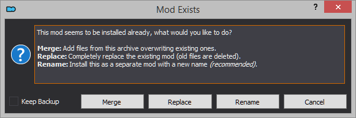

[<< Back to Readme](readme.md)

> PROTIP: Click on the list icon on the upper left corner of this document to see the index for this guide.

# MORROWIND S#ARP SETUP

## Requirements

- An english copy of the game from [**GOG**](https://www.gog.com/game/the_elder_scrolls_iii_morrowind_goty_edition?gclid=EAIaIQobChMIoaWD-6LP6AIVCxCRCh2a5gPiEAAYASAAEgIUSvD_BwE).
  - Installation instructions are found on the next section. 
- A [**Nexus**](https://users.nexusmods.com/register) account. This guide assumes you are using a Free account, so no need to pay for Premium.
- A file archiver. I recommend [**7-Zip**](https://www.7-zip.org/).
- A text editor. I recommend [**Notepad++**](https://notepad-plus-plus.org/downloads/v7.9.5/).
- [**.NET 6 Runtime**](https://dotnet.microsoft.com/en-us/download) (for TES3Merge, a conflict resolution tool).

> ⚠️ Users have reported issues with Mod Organizer 2 when using the Steam release of the game, which is why it is not supported by this guide.

> ℹ️ Morrowind originally shipped with a detailed map which is absent from digital stores. [**You can get this map here.**](pictures/map.jpg)

## Installation

You should install Morrowind outside all default Windows folders (Program Files, Program Files (x86), Desktop, and Documents for example). Windows User Account Control monitors these folders, which can cause problems later on.

Your Morrowind **Root** folder is where Morrowind will be installed, and where the game's executable (**Morrowind.exe**), launcher (**Morrowind Launcher.exe**), and **Data Files** folder will be found.

By default, GOG will install Morrowind to the next directory:
```
C:\Games
```
This will create a folder in the following path, which we will refer to as our **Root** folder.
```
C:\Games\Morrowind
```
Additional, you will need a folder where to install our mod manager and keep your mods. I recommend the following path:
```
C:\Games\Morrowind Sharp
```

> ⚠️ Make sure you don't create your Morrowind Sharp folder inside your Morrowind folder. Mod Organizer 2 will fail to register your installed mods.

### Cleaning up your GOG installation

The GOG release of Morrowind shipped with files that are of no use to the average player. These files are not necessary and do nothing but clutter up your installation. Some of the files we will delete are the official plugins Bethesda released for Morrowind. These are to be considered low quality mods, and not worth your time. [**You can read about the official plugins here.**](https://en.uesp.net/wiki/Morrowind:Plugins)

All said, delete the following from your **Morrowind\Data Files** folder in order to free about 700 MBs from your install:

- The **BookArt**, **Icons**, **Meshes**, and **Textures** folders.
- All **.esp** files. There should be 8 of them, corresponding to the 8 official plugins.
- All **.txt** files. There should be 8 of them, corresponding to the 8 official plugins.

Your Data Files folder should now look like this.


# UTILITIES AND TOOLS

## Preamble

In order to address a handful of issues with the Morrowind program (Morrowind.exe), and improve the visual fidelity of our game, we will install a number of tools.

In addition, we will install a mod manager to help us keep our mods organized, and a series of additional tools to help us fix conflicts between our mods to get our install running as smoothly as possible.

## [**Morrowind Code Patch**](https://www.nexusmods.com/morrowind/mods/19510)

Directly patches bugs in the Morrowind program (Morrowind.exe), which cannot otherwise be fixed by editing scripts or data files. It is a must-have utility for anyone who plays Morrowind, and should be the first utility you ever install.
- Manually download **Morrowind Code Patch** (Main files).
- Extract the contents of the file in your Morrowind **Root** folder (**C:\Games\Morrowind**).

## [**MCP Skunk Works**](https://www.nexusmods.com/morrowind/mods/26348)

Repository for the Beta update for the Morrowind Code Patch. Despite being a beta, the patch is perfectly stable and no crashes have been reported from my end or other users of the guide.
- Manually download **MCP beta** (Update files).
- Extract the contents of the file in your Morrowind **Root** folder (**C:\Games\Morrowind**), and overwrite when prompted.

### Morrowind Code Patch setup

- Execute **Morrowind Code Patch.exe**, found in your **Root** folder.
- The **Morrowind Code Patch** will prompt you to install your patches of choice. Use this [**spreadsheet**](https://docs.google.com/spreadsheets/d/1r6fv59to4-KgHJgCm-GDNnwSmD3LdDmamSDEs5jKFdM/edit?usp=sharing) as a reference to install or skip patches.
- Click **Apply chosen patches** when you are finished. Close the application.

> ℹ️ A backup of **Morrowind.exe** (pre-patch) will apear in your **Root** folder, named **Morrowind.Original.exe**.

## [**MGE XE**](https://www.nexusmods.com/morrowind/mods/41102?)

The Morrowind Graphics Extender XE allows Morrowind to render distant views, scenery shadows, high quality shaders and other features. MGE XE supports and includes the latest **MWSE 2.1 beta**, so that the newest Lua-based mods work straight away.

- Manually download **MGE XE Installer** (Main files).
- Extract the contents of the file and run the **MGE XE Installer.exe**.
- When prompted to choose an install location, choose your **Root** folder (**C:\Games\Morrowind**).
- When installation has finished, uncheck both options and click **Finish**.
- Go to your **Morrowind\Data Files** folder and delete **XE Sky Variations.esp**.

> ℹ️ **XE Sky Variations** is an optional mod included in MGE XE that will randomize the sky colour and sunrise/sunset every day. It requires high quality sky scattering enabled (more on that later) and MWSE to be installed. However, a more modern alternative in the form of **Weather Adjuster**, a mod we will install further ahead, is available.

Because Morrowind wasn't designed with distant land in mind, certain in-game scenarios which affect the landscape of Morrowind can cause annoying visual issues in the form of pop-ins or fade outs. **Distant static overrides** tell MGE XE to ignore standard distant land generation rules in order to account for these scenarios.

[**abot Distant Static Overrides - Necro Edit 2.0**](mods/Abot%20Distant%20Statics%20Override%20-%20Necro%20Edit%202.0.7z)  
**Necrolesian**'s edit of **abot**'s custom distant static overrides, which accounts for different stages of the Morrowind and Bloodmoon main quests, as well as certain quests which modify the game's landscape.
- Extract the contents of the file.
- Place the contents of the **necro_distant_statics_override** folder in your **Morrowind\mge3** directory, overwriting when prompted.

This file contemplates the following landscape-altering scenarios:

- The completion of the Main Quest.
- The completion of Bloodmoon's Main Quest.
- The progress and completion of Boethiah's Daedric Quest.
- The completion of the Siege at Firemoth official plugin.
- The completion of the construction of each Great House Stronghold.
- The completion of Raven Rock's construction.

> ℹ️ The **Readme** elaborates on how to use these overrides, so you should definitely give it a read.

## [**Wrye Mash**](https://www.nexusmods.com/morrowind/mods/45439)

Used to repair and update saves, update the masters of mods, and to run tes3cmd in order to clean plugins and generate a **multipatch**.
- Download and run **Wrye Mash 2019 x64 - Installer** (Main files).
- When prompted to choose an install location, choose your Morrowind **Root** folder (**C:\Games\Morrowind**).
- When installation has finished, uncheck the option and click **Finish**.
- Download **Wrye Mash 2021 - x64 - beta6 - manual installation archive** (Update files).
- Extract the contents of the file in your Morrowind **Root** folder (**C:\Games\Morrowind**), and overwrite when prompted.
- Launch **mash64.exe**, found in your **Morrowind\Mopy** folder.
- Eventually the installation wizard will ask you to fill the following entries:
   - **Morrowind directory**: select your Morrowind **Root** folder (**C:\Games\Morrowind**). A message should state that morrowind.ini and the Data files folder were found.
   - **Mods Installers directory**: select your Morrowind Sharp folder (**C:\Games\Morrowind Sharp**).
- Click **Next** and then click **Finish**.
- Wrye Mash will now launch. Click **Yes** on the pop-up asking you to enable the MWSE 1024 plugin support. Failing to enable this option can cause you to be unable to repair your saves.
- Close the program.

> ℹ️ The **Mods Installers directory** we left empty above is redundant to us, as we will use Mod Organizer 2 to install our mods. However, assigning a directory is required to install Wrye Mash.

> ℹ️ **Mlox** is a tool to analyze and sort your plugin order. However, there's no need to install it when following **Morrowind Sharp**.

## [**tes3cmd**](https://github.com/john-moonsugar/tes3cmd/releases/)

Used to clean plugins by automatically deleting identical-to-master records (records that are usually *unintended* by the author as they do nothing in practice, but which may override *intended* changes by other mods) and solve a number of conflicts/issues by means of a plugin, **multipatch.esp**.
- Expand **Assets** under "v0.40-pre-release-2 (with trial Windows .exe)" and download **tes3cmd.exe**.
- Place tes3cmd.exe in **C:\Games\Morrowind\Data Files**.

## [**TES3View**](mods/TES3View%204.1.4.7z)

Used to see the structure of mods and detect conflicts.
- Extract the contents of the file in **Morrowind Sharp\Tools\ES3View**. 

> ℹ️ The version I'm hosting can be downloaded from [**xEdit's GitHub**](https://github.com/TES5Edit/TES5Edit/releases). Both the folder and the .exe have been renamed to TES3View in order for the tool to work for Morrowind, and several unnecessary .exes dropped to reduce download size.

## [**TES3Merge**](https://www.nexusmods.com/morrowind/mods/46870)

Used to solve conflicts by merging conflicting records into a separate plugin, **Merged Objects.esp**.
- Extract the contents of the file in **Morrowind Sharp\Tools\TES3Merge**.

## [**TESAME**](http://mw.modhistory.com/download-95-15443)

Used to clean plugins and solve conflicts by manually deleting conflicting or dirty records (unintended changes by the mod's author).
- Extract the contents of the file in **Morrowind Sharp\Tools\TESAME**.

## [**Mod Organizer 2**](https://www.nexusmods.com/skyrimspecialedition/mods/6194)

An excellent mod manager, offering lots of quality of life conveniences that make modding an easy and quick process. The most popular alternative is **Wrye Mash**. However, I’ve found that it isn’t anywhere near as intuitive as Mod Organizer 2 is, which is why we will only use it for the features Mod Organizer 2 lacks.
- Manually download **Mod Organizer 2** (Main files).
- Run the **Mod Organizer 2.exe**.
- When prompted to choose an install location, choose your Morrowind **Mods** folder (**C:\Games\Morrowind Sharp\MO2**).
- When installation has finished, uncheck the option and click **Finish**.

> ⚠️ It is imperative that, from this point on, you always use Mod Organizer 2 to run the game and to launch any tools you need to use. Mod Organizer 2 uses a Virtual Files folder, which is kept separate from your Morrowind installation. Failing to run the game through Mod Organizer 2 will mean the game won't register any of the installed mods.

### Mod Organizer 2 initial setup

- Run **ModOrganizer.exe**.
- Mod Organizer 2 will prompt you to **Create a new instance**. Click **Create a portable instance**.
- You will be asked to select a game to manage. Click **Browse...** and select your Morrowind **Root** folder.
- You will be asked to select a folder where data will be stored. The default MO2 folder is fine.
- Click **Next** and then **Finish**. Mod Organizer 2 will now launch.
- From the pop-up called **Register?**, click **Yes**. This will allow Mod Organizer 2 to handle Nexus links.

> ℹ️ If Mod Organizer 2 prompts you to **Show tutorial?**, click **No**.

### Adjusting mod and load order

Your installed mods are listed on the pane to the left. This is the order in which Morrowind loads their assets, with mods closer to the bottom overwriting the assets of mods closer to the top (if conflicting assets are present). We will refer to it as our **mod order**.

Reorganize it to read as follows using drag and drop.
```
DLC: Tribunal
DLC: Bloodmoon
```
Your plugins are listed on the pane to the right. This is the order in which Morrowind loads their plugins, with plugins closer to the bottom overwriting the records of plugins closer to the top (if conflicting records are present). We will refer to it as our **load order**.

Reorganize it to read as follows using drag and drop.
```
Morrowind.esm
Tribunal.esm
Bloodmoon.esm
```

> ℹ️ You can hide unnecessary information in Mod Organizer 2 by right clicking on the headers above the installed mods, and unchecking the tabs you don't want to see. I suggest unchecking everything but the **Conflicts**, **Flags**, and **Priority** boxes. You can also click on the **X** to the bottom right of the **load order** panel, hiding unnecessary background information seen on the pane below.

### Adjusting Morrowind.ini

One of the patches we installed with the Morrowind Code Patch, **Rain/snow collision**, requires a few .ini edits to work properly.

- Click the **Tools**  button, and click **INI Editor**. **morrowind.ini** will now open.
- Use CTRL+F to input the section names and edit the respective entries to use these values. Note that **Weather Snow** may be found much further down below than the others, just below the **Archives** section.

```
[Weather Rain]
Rain Diameter=1200
Max Raindrops=1500

[Weather Thunderstorm]
Rain Diameter=1200
Max Raindrops=3000

[Weather Snow]
Snow Diameter=1600
Max Snowflakes=1500
```

- Click **Save** and close the window.

### Setting up Profiles

Mod Organizer 2 has a feature called **Profiles**, which lets you quickly change from one mod setup to another.

- Click the **Configure profiles**  button.
- Check the following options:
  - [X] Use profile-specific Game INI files.
  - [ ] Use profile-specific Save Games.
  - [ ] Automatic Archive Invalidation.
- With the **Default** profile selected, click **Copy**. Type in **Morrowind Sharp** and click **OK**. Close the window.
- On the **Profile** tab, select the **Morrowind Sharp** profile.

Morrowind Sharp will be the profile we'll be modding. You can always revert to the **Default** profile to quickly deactivate all installed mods.

### Registering tools in Mod Organizer 2

For our modding tools to work in Mod Organizer 2, we need to register and configure them.

Follow these steps for **Wrye Mash**:
- Click the **Modify Executables**  button.
- Click the **Add an executable**  button and select *Add from file...*.
- Navigate to **C:\Games\Morrowind\Mopy** and double click **mash64.exe**.
- Click **Apply** and then **OK**.

Follow these steps for **TES3Merge**, **TESAME**, and **TES3View**:
- Click the **Modify Executables**  button.
- Click the **Add an executable**  button and select *Add from file...*.
- Navigate to the folder of the tool you want to install (each found inside **C:\Games\Morrowind Sharp**) and double click its .exe file.
- In the **Start In** field, select your Morrowind **Root** folder (**C:\Games\Morrowind**).
- Click **Apply**, and repeat the process for the remaining tools.

> ℹ️ Unlike the other tools, tes3cmd doesn't need to be registered in Mod Organizer 2 as it is directly run from Wrye Mash, which we have already registered.

## Configuring MGE XE in Mod Organizer 2

- In Mod Organizer 2, click on the executables dropdown menu to the left of the **Run** button, and select **MGE XE**. 
- Click **Run** to run the executable.

### In-game tab


> ⚠️ You may be tempted to enable **High detail actor shadows (buggy)**. As the name says, they are buggy and can be very taxing on your framerate. I don't recommend them.

### Config tab

**Information**
- Click the **Report max AA and AF** under **Information** to get your graphics card's max antialiasing and anisotropic filtering levels.

### Graphics tab


Apart from the recommended settings (as seen on the image), there are a couple of options you should look out for.

**Display**
- You should select your resolution and refresh rate.
- Set your **Antialiasing** and **Anisotropic filtering** settings to the values reported in the **Config** tab.
- Turn **VSync** on to prevent screen-tearing.

**Windowed mode**
- Most users then to ALT+TAB during gameplay. However, if you want to maximize performance at the cost of stability when ALT+TABbing, you should uncheck this option.

**Renderer**
- Check **Enable shaders**.
- Higher **Menu UI scaling** settings will scale up the UI. If you are playing on high resolutions (1080p and higher) I recommend starting with values at 1,20.
- Lower **FPS Limiter** settings will increase the consistency of your framerate. I personally set it to **60**.

**Shader setup...**
- On the **Set active shaders** window, click **Modding >>>**. Double clicking on the **Available shaders** makes them **Active shaders**, meaning the game will run them.
- For now, set your shader combination as follows.
```
SSAO HQ
Underwater Effects
Underwater Interior Effects
Sunshafts
```
- Click **Save** after setting up your shader chain.

> ⚠️ Note that **Antialiasing**, **Anisotropic filtering**, **VSync**, and **Enable shaders** will all take a heavy toll on your framerate.

### Distant Land tab

This tab lets you generate distant land, which in other words means you will see beyond the vanilla Morrowind fog. Tweaking these settings to achieve the optimal look can be difficult, and it boils down to personal taste. Distant Land can really hurt your FPS, especially when used alongside shaders, as there's more to post-process.

All options minus **Use Distant Land** and **Distant land generator wizard** are disabled when you get to this tab. We need to generate distant land for these options to become available.

- Click **Distant land generator wizard**.
- On the **Distant Land Setup Wizard**, click **Select all**. The checked plugins will be used for distant land generation.
- Click **Continue**. This will open the **Distant Land Generation** window.
- In the **Land Textures** tab, simply click **Create Land Textures**. By default, the options you should see are 2048 and 1024 texture and normalmap resolution, respectively.
- In the **Land Meshes** tab, select **Ultra High** from the **World mesh detail** dropdown menu. Click **Create Land Meshes**.
- In the **Statics** tab:
  - Set **Minimum Static Size** to 100.
  - Check **Include reflective water in interiors**.
  - Check **Use lists of statics overriding parameters set above**.
  - Click **Edit list**.
    - Click **Add**.
    - Navigate to your **Morrowind\mge3** folder, and double-click **00_main.ovr**.
    - Click **Save**.
  - Click **Create Statics**.
- Once the statics have been created, click **Finish**.

> ℹ️ A rule of thumb is to regenerate your distant land any time you install or uninstall mods. Most importantly, the process will be much easier as you only need to click on **Run above steps using saved / default settings** the next time you are on the **Distant Land Generation** window. On your first distant land generation, MGE XE defaults to **Distant Land configuration setup...**.


Now that you are back on the **Distant Land** tab you will see all previously unavailable options are now enabled. To get you started, I recommend you copy the settings as shown in the image above. In the future you may want to modify them.

> ℹ️ These draw distance settings will preserve the foggy aesthetic of vanilla Morrowind, which I recommend over the absurd draw distance seen in most modern Morrowind screenshots. If you are aching for a little bit of extra draw distance, I suggest increasing the **Draw Distance** to 5,0, and cranking up the **Above Water Fog** settings to Start 3,0 and End 5,0.

> ⚠️ Note that Per-pixel lighting takes a heavy toll on your framerate. You can disable it entirely, or limit it to **Interiors only**.

# IN-GAME CONFIGURATION

It's time to finally run Morrowind.

- In Mod Organizer 2, click on the executables dropdown menu to the left of the **Run** button, and select **Morrowind**. 
- Click **Run** to run the executable.

> Always remember to run Morrowind through Mod Organizer 2 to detect the Virtual Files folder.

- Once the game has finished loading, click **Options** and click the **Video** tab.
- The **Gamma Correction** slider lets you increase/decrease the brightness of your game. I like to play Morrowind with the slider roughly 40-45% of the way from left to right, making the game look less washed out.
- Turn the **Real-time Shadows** slider all the way to the left, disabling them. Morrowind's shadows are buggy, ugly, and are not worth the performance hit.
- Turn the **View Distance** slider all the way to the right, maximizing render distance for actors and other statics.

> ⚠️ If your game crashes when trying to access the **Video** tab, it may be because you are running Morrowind at a resolution unsupported by the game.

> ⚠️ You should not adjust your resolution through the **Video** tab, as it will crash the game. Instead, run **MGE XE** and adjust it there.

# GENERAL TIPS

## Mod Organizer 2 tips

### Mod manager download installation

Mods downloaded from Nexus will be instantly added to Mod Organizer 2 when using the **Mod manager download** option. However, you still need to install these mods for them to work in-game.

- In MO2, click on the **Downloads** tab. You can check the download progress for your file there.
- Right-click the downloaded file, and click **Install**.
- Click **OK**.
- The mod will appear in the left pane. To activate the mod, check the box next to it by clicking the box.

When installing a mod, use the name provided for it in the guide's **hyperlink**. For example, the guide lists the following mod's name as **Graphic Herbalism - MWSE and OpenMW Edition**.


Whenever you install a mod in Mod Organizer 2, the mod manager assigns it a default name, which is either the name of the Nexus page from where it is being downloaded from, or, when manually installing a mod, the name of the file.

### Multiple files installation

There will be times when you will need to install multiple files from a single mod page. Mod Organizer 2 will prompt you with the following box.



What these options do is simple:

- **Merge** merges the contents of the file being installed with those of the file of the same name already installed. The new files will take priority over the old files, overwriting as necessary. This option is generally recommended when installing an update file that is separate from the main file, or optional files in the case you don't want to clutter your mod order.
- **Replace** will delete the installed mod, and install the new mod. This option is generally recommended when installing a new version of a mod, as old files may no longer be used by the new version.
- **Rename** will install the mod under a different name, as a separate, additional mod. This option is generally recommended when installing multiple mods from a single mod page that are unrelated to each other (as is the case of compilation pages that list many mini-mods, such as [**Half11's Misc Mods**](https://www.nexusmods.com/morrowind/mods/47068)).

All files installed from a same Nexus page should be merged into a single mod when using Mod Organizer 2. They should also be merged in the order they are listed in this guide, to avoid potential problems (such as update files being overwritten by older files from a same mod). The rule of thumb to use is that one hyperlink in the guide = one single mod on your MO2's left pane.

When the guide asks no specific file to be installed, it is implicit that the file you should download and install is the only main file available for download. Elsewhere, specific instructions will point you in the right direction.

### Manual download installation

Sometimes authors will block the **Mod manager download** option in Nexus, and you will have to download the mod manually. On occasion, you will download a mod from a different site altogether, be it GitHub, Google Drive, or Morrowind Modding History.

- In MO2, click the **Install a new mod from archive**  button.
- Navigate to the folder where the downloaded file is stored and double click on it.

The rest of the steps work exactly as during mod manager download installation.

### BAIN and FOMOD installers

BAIN and FOMOD installers allow users to customize their install by spliting their mods into multiple options. BAIN installers generally provide a **Core** option which needs to be installed for the mod to work at all, but this option is not always provided, and neither is it always required. FOMOD installers are much more detailed, generally intuitive as opposed to BAIN installers, but sadly these aren't as common in the Morrowind modding scene.

Mod Organizer 2 supports both types of mod installers. Note that this guide will always list the options you should install. If missing, the options should be skipped.

### Repackaging mods

There will be times you'll be greeted with the following message when installing a mod through Mod Organizer 2.


In lieu of mod authors not fixing their mods themselves, there are two ways to fix this.

- Repackage the mod yourself and install it through Mod Organizer 2.
- Repackage the mod yourself in Mod Organizer 2.

Mod Organizer 2 recognizes anything resembling a valid file structure (having folders such as **Meshes**, **Textures**, **Icons**, etc., or **.esp** and **.esm** files), allowing you to install it.

In the case shown above, the mod contains a **Data Files** folder and a loose **.txt** file acting as the mod's documentation.

- Right-click on **Data Files**.
- Click **Set as data files directory**.
- Click **OK** to install the mod.


In other cases, mods contain loose assets, and you will have to create folders to package them properly.

- Right-click on the **data files** root directory and click **Create directory...**.
- Enter the name of the folder you want to create, and click **OK**.
- Drag and drop your files in the appropriate folders.
- Click **OK** to install the mod.

### Hiding files

Mod Organizer 2 lets you hide specific files from your installed mods, be it assets or plugins. A hidden plugin is treated as a deactivated plugin, with the bonus that it will no longer clutter your load order. Hiding assets is useful when you don't want to install specific assets, or when you don't want them to overwrite another mod's.

- Right click on your installed mod and click **Information...**.
- On the **Filetree** tab, right click on the plugins, folders, or files you want to hide, and click **Hide**.
- Mod Organizer 2 will hide the files, and these will no longer affect your game.

### Overwrite folder

The **Overwrite** folder is the destiny folder for the output of many of the tools we installed in **Setup**, e.g. distant land generation will place its contents inside the **distantland** folder, configurable MWSE mods will place their files inside the **MWSE\config** folder. There's always a chance files in the **Overwrite** folder will overwrite assets and/or plugins from your installed mods.

## Modding tips

The following aren't strict rules, but tips to follow if you are new to modding Morrowind.

- Always keep backup saves, particularly so when uninstalling or installing mods.
- Read mod descriptions. They usually list requirements, compatibility with other mods, and known issues. User comments can also list issues and possible fixes, but take these with a grain of salt. Many users erroneously claim a mod isn't working, because of end user mistakes.
- Don't uninstall or install mods mid-playthrough, unless you know for sure you can do it safely. Mod descriptions and user comments can help you out here.
- Learn how file structure works. Incorrect file structure means mods will not work as intended.
- Register BSA files when appropriate. BSA files contain data files for the mod you are installing, or for other mods to use as a resource. Failing to register your BSA files can cause [**yellow exclamation triangles**](https://external-preview.redd.it/dl-I4l_Pzm5autet-87p1hnU1btUavtiu1mtwGzWBko.png?width=960&crop=smart&auto=webp&s=3d180a6476cad80c332c12be08252511a0044c5c). This can also happen when a mod you are installing is missing assets.

> ℹ️ To register a BSA file, launch Wrye Mash from Mod Organizer 2. In the **Mods** tab, click the **BSA Archives** tab to the right, and check the BSA you want to register.

# MOVING ON TO THE NEXT SECTION

[To Morrowind Sharp >>](main.md)  
[<< Back to Readme](readme.md)
